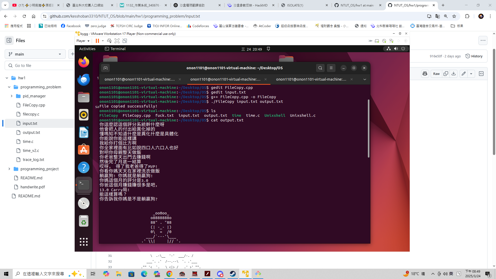
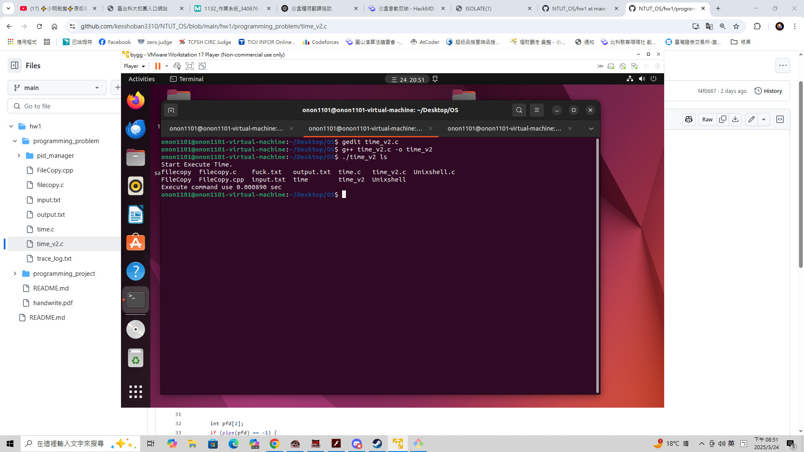
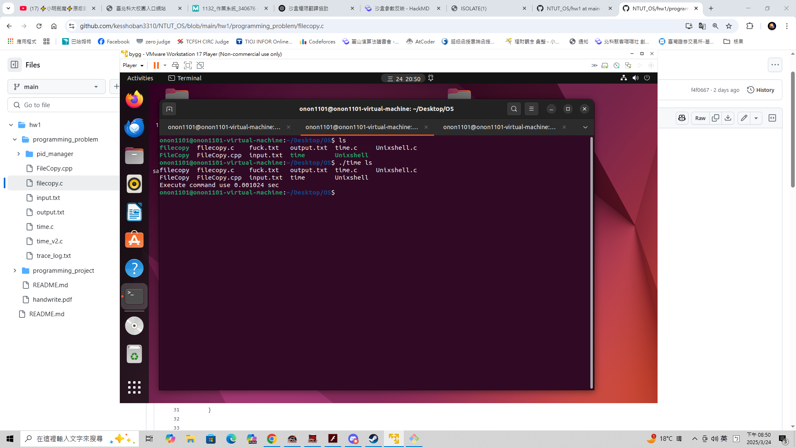
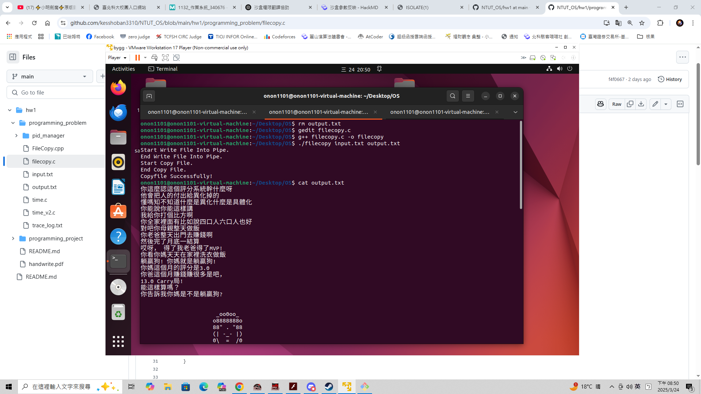

# OS Hw1

> [!NOTE]  
> 在本次作業中有許多程式作業與手寫作業。  
> `handwrite.pdf` 是本人的手寫作業
> `programming_problem` 是本人的程式作業。
> `programming_project` 是團體程式作業，裡面有一個 `README.md` 是團體程式作業的文件。  

## Handwrite.pdf

> 本人撰寫之手寫作業，內容參考至老師上課簡報、指定教科書及部分網路內容。

## Programming_problem

> [!IMPORTANT]  
> 實作所有 `HW1` 之程式作業，包含 `optional` 。  
### problem 2.24

> [!TIP]  
> 檔名為 `FileCopy.cpp`。  
> 編譯方式為 `gcc FileCopy.cpp -o FileCopy`。  
> `./FileCopy <src> <dsc>` 為使用方法，像是 `./FileCopy input.txt output.txt` 。  
> 檢查參數正確、是否有來源檔案，目的檔案名稱是否重複等功能。  
> 使用 `strace` 之檢查檔案為 `trace_log.txt` 。

### problem 3.19

> [!TIP]  
> 檔名為 `time.c` 及 `time_v2.c`。  
> 編譯方式為 `g++ time.c -o time` ，以 `time.c` 為例。  
> `./time <command> [args]` 為使用方法，像是 `./time ls` 。  

  

### problem 3.20

> [!TIP]  
> 檔案在 `pid_manager` 內，包含相關測試檔，主要是 `pid_manager` 開頭檔案 。  
> 編譯方式為 `make install_gtest` ，如果安裝完後再下 `make` ，輸出檔案在 `output` 資料夾裡面。  
> `./test_pid_manager` 為使用方法，輸出由 `gtest` 生成之測試結果檔。

### problem 3.27

> [!TIP]  
> 檔名為 `filecopy.c`。  
> 編譯方式為 `g++ filecopy.c -o filecopy`。  
> 使用方法同 `problem 2.24` 。    
> 檢查參數正確、是否有來源檔案，目的檔案名稱是否重複等功能。  

  

## Programming_project

> 相關資訊已經檢附在資料夾的 `README.md` 內。  
