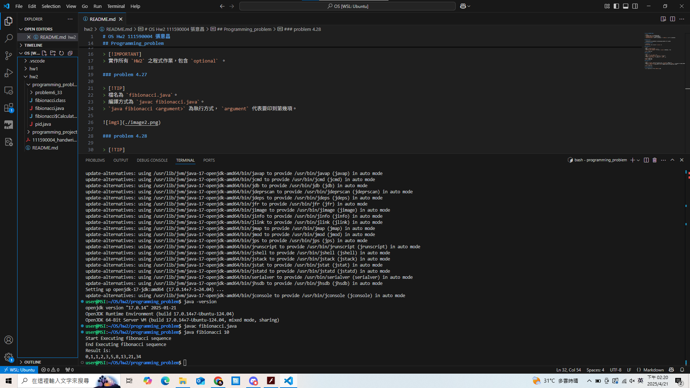
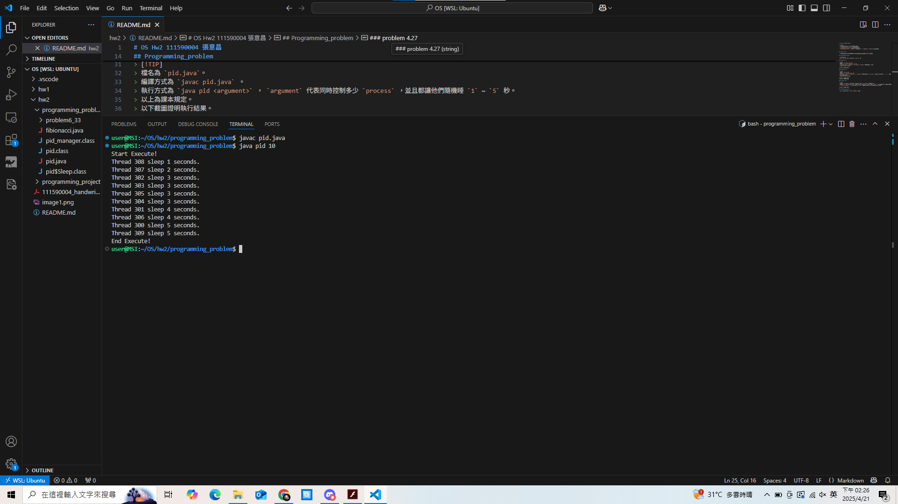
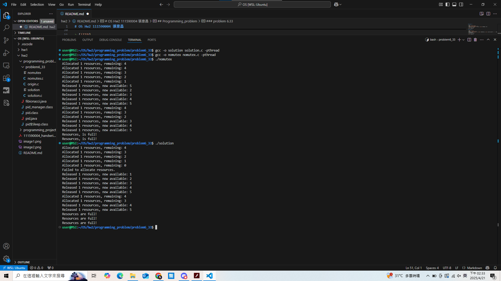

# OS Hw2 111590004 張意昌

> [!NOTE]  
> 在本次作業中有許多程式作業與手寫作業。  
> `111590004_handwrite.pdf` 是本人的手寫作業
> `programming_problem` 是本人的程式作業。
> `programming_project` 是團體程式作業，裡面有一個 `README.md` 是團體程式作業的文件。  

## Handwrite.pdf

> 本人撰寫之手寫作業，內容參考至老師上課簡報、指定教科書及部分網路內容。

## Programming_problem

> [!IMPORTANT]  
> 實作所有 `HW2` 之程式作業，包含 `optional` 。  

### problem 4.27

> [!TIP]  
> 檔名為 `fibionacci.java`。  
> 編譯方式為 `javac fibionacci.java`。  
> `java fibionacci <argument>` 為執行方式， `argument` 代表要印到第幾項。  
> 以下截圖證明執行結果。  

### problem 4.28

> [!TIP]  
> 檔名為 `pid.java`。  
> 編譯方式為 `javac pid.java` 。  
> 執行方式為 `java pid <argument>` ， `argument` 代表同時控制多少 `process` ，並且都讓他們隨機睡 `1` ~ `5` 秒。  
> 以上為課本規定。    
> 以下截圖證明執行結果。   

  

### problem 6.33

> [!TIP]  
> 檔案在 `problem6_33` 內， `origin.c` 為原始檔案，請不要執行。  
> 編譯方式為 `gcc -o <excutefile> <filename> -pthread` 。  
> 以 `solution.c` 為例， `gcc -o solution solution.c -pthread`。  
> `./<excutefile>` 為使用方法，會列印出 `threads` 之間分別做那些指令。  
> `solution.c` 為問題的解， `nomutex.c` 則是不用 `mutex lock` 結果。  
> 以下會回答程式問題以及截圖證明可用。  

  

> [!IMPORTANT]  
> 以下是問題的解。  
> (a). `available_resources` 參與了 `race condition` ，因為多個 `thread` 在調度他時可能會導致資料錯誤或覆蓋。  
> (b). 以 `origin.c` 為例，也就是第 `11` 、 `17` 行中，可能會導致 `race condition` 的情況發生 (對變數進行修改) 。  
> (c). 也就是 `solution.c` ，使用 `mutex lock`。  
> 另外，針對 `increase_count` ，會限制最大資源是 `5` ，避免多加。  
> 可以看到上述截圖內沒有使用 `mutex lock` 時，順序是亂的，有衝突產生。  
> 使用 `mutex lock` 時，沒有衝突產生，並且每個 `thread` 有順序的完成工作。  

## Programming_project

> 相關資訊已經檢附在資料夾的 `README.md` 內。  