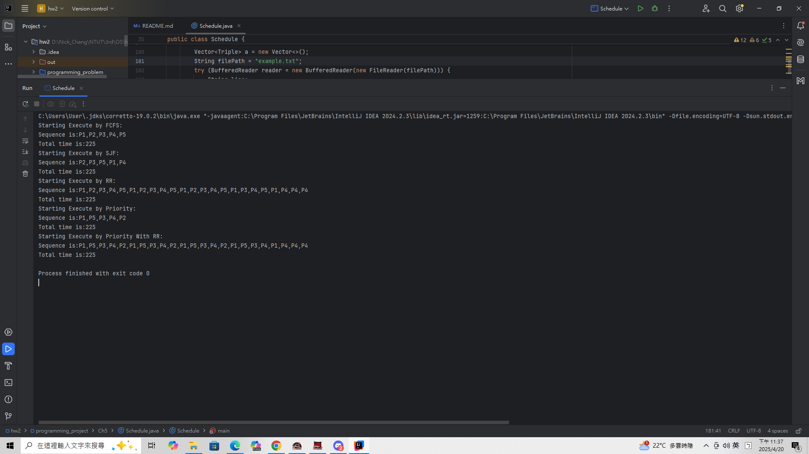

# Programming Project

## Unit 2

### How to Compile

### How to use

### Picture

## Unit 5

> [!NOTE]  
> 在 `Unit 5` 的實作 `Project` 裡面，我們選擇要進行的事情是做 `Scheduling Algorithm` 。  
> - FCFS (First come first surve)
> - SJF (Short Job First)
> - RR (Round Robin)
> - Priority 
> - Priority with RR  
> `Priority` 數字越大越優先， `RR` 的 `Quantum` 為 `10` 。  
> `Priority` 的數字 `1~10` ， 時間最大為 `100` 。  
> 以上皆參考至 `OS` 老師指定之教科書內容。

### How to Compile

> [!NOTE]  
> 請使用 `javac Schedule.java` 進行編譯。  
> 請在該目錄下面執行，或是使用 `linux` 解決無法讀檔的問題。  
> 如果要使用 `jetbrain` 或是其他 `ide` 執行，請確保執行在 `Ch5` 這個資料夾下面。  
> `example.txt` 是任務的內容，你可以自行新增任務。  
> `PX <burst time> <priority>` 代表第幾個任務、時間、優先權。

### How to use

> [!TIP] 
> 使用 `java Schedule <argument>` 執行編譯後的程式。  
> `<argument>` 包含以下內容：  
> `FCFS`代表 `FCFS (First come first surve)`  
> `SJF` 代表 `SJF (Short Job First)`  
> `Priority` 代表 `Priority`  
> `RR` 代表 `RR (Round Robin)`  
> `PriWRR` 代表 `Priority with RR`  
> `All` 代表 `以上都跑一次`

### Picture

> 以下會附上截圖證明專案可編譯，以及執行結果 (以 `All` 為範例) 。  
> 會告訴使用者使用啥演算法進行排程，並且列印工作順序，以及總執行時間。  

# 組員名單及貢獻度

- 111590004 張意昌，進行 `Ch5 Scheduling Algorithm` 程式撰寫。[25%]
- 111590011 吳耀東，進行 `jiffies.c` 測試並撰寫使用文件。[25%]
- 111590012 林品緯，進行 `seconds.c` 測試並撰寫使用文件。[25%]
- 111590028 張睿恩，進行 `Ch5 Scheduling Algorithm` 文件撰寫及測試。[25%]
- 每人貢獻皆為 `25%` ，總共為 `100%` 。
