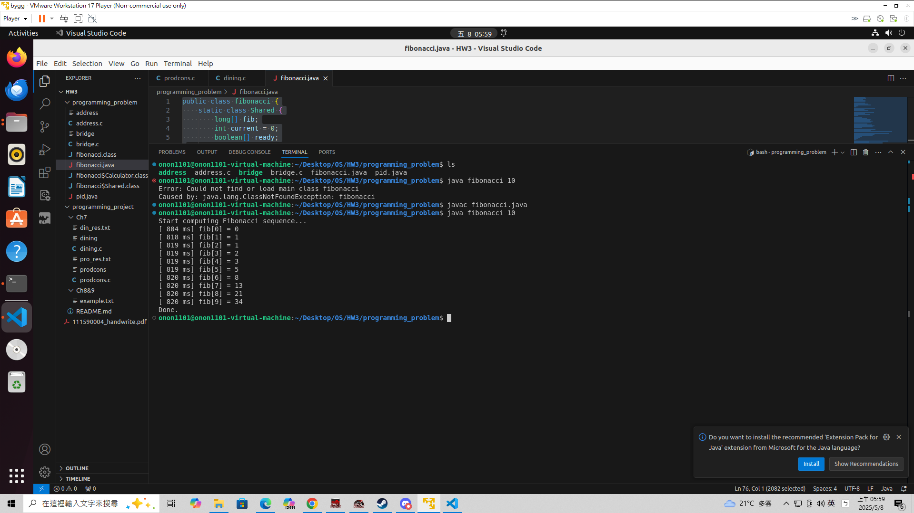
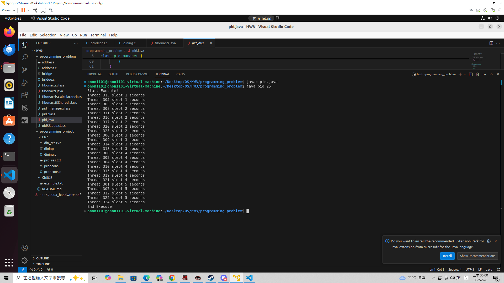
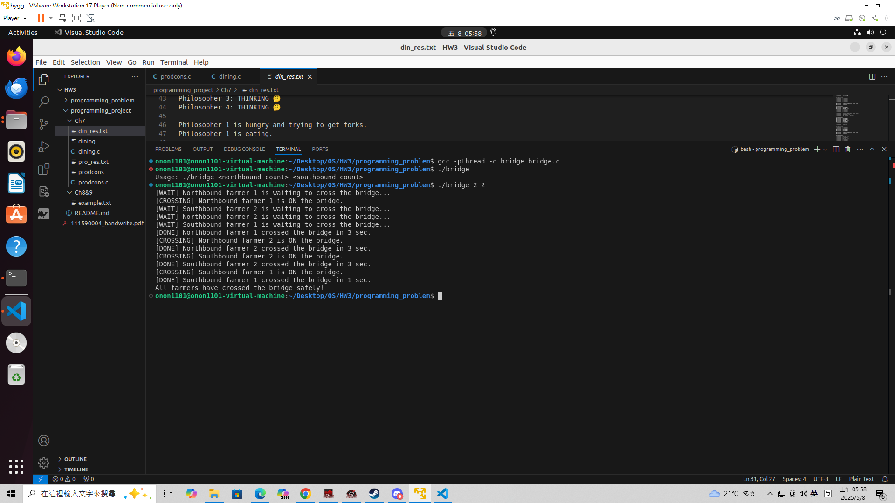
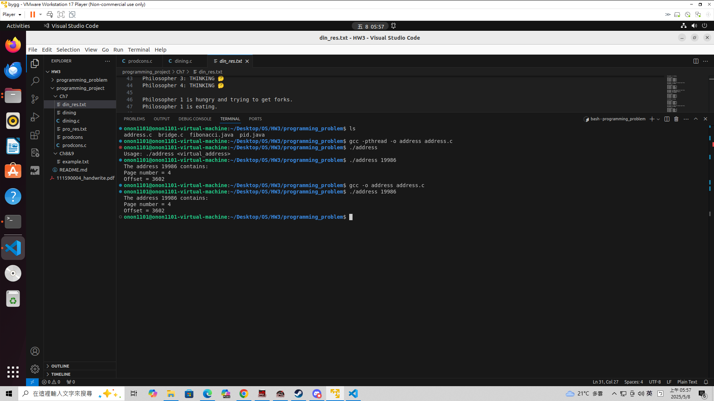

# OS Hw3 111590004 張意昌

> [!NOTE]   
> 在本次作業中有許多程式作業與手寫作業。  
> `111590004_handwrite.pdf` 是本人的手寫作業。  
> `programming_problem` 是本人的程式作業。  
> `programming_project` 是團體程式作業，裡面有一個 `README.md` 是團體程式作業的文件。  

## Handwrite.pdf

> 本人撰寫之手寫作業，內容參考至老師上課簡報、指定教科書及部分網路內容。

## Programming_problem

> [!IMPORTANT]  
> 實作所有 `HW3` 之程式作業，包含 `optional` 。  

### problem 7.15

> [!IMPORTANT]  
> `problem4.27` 中，我們需要用 `Thread` 去產生費氏數列  
> 這次則是要讓子執行緒一算到答案後直接給父執行緒輸出結果  
> `javac fibonacci.java` 進行編譯  
> `java fibonacci 10` 代表執行前十項，後面數字多少就是執行多少項，可調整  

  

> [!NOTE]
> 為確認一算到答案後就直接列印，輸出結果的時間就是得到答案的時間
> 可以看到會有多項同時輸出，達到結果  

### problem 7.14

> [!IMPORTANT]  
> `problem3.20` 中，我們設計一個 `PID Manager`  
> 這次則是要做 `Thread Safe` ，解決掉 `race condition`  
> `javac pid.java` 進行編譯  
> `java pid 10` 代表執行十個 `process` ，後面數字多少就是執行多少項，可調整，最多4000左右  

  

> [!NOTE]
> 跟前幾次作業差不多，只是管理器使用同步機制避免 `race condition` 的發生  

### problem 8.32

> [!IMPORTANT]  
> 這次題目中，我們要設計南北橋農夫過橋問題  
> 由於橋同時只能有一個農夫通過，所以要設計同步機制讓農夫之間不會打架，一次一人過橋   
> `gcc -pthread -o bridge bridge.c` 進行編譯  
> `./bridge <north> <south>` 兩個 `<>` 可填入任意數量的農夫    

  

> [!NOTE]  
> 輸出結果為現在誰要過橋，若有人過橋，則其他人會顯示等待  
> 過橋時間為隨機，應該不超過 `3` 秒
> 結束後會顯示結束  
### problem 9.28

> [!IMPORTANT]  
> 這次題目中，我們要設計 `Page` 的頁面計算機  
> 由於橋同時只能有一個農夫通過，所以要設計同步機制讓農夫之間不會打架，一次一人過橋   
> `gcc -o address address.c` 進行編譯  
> `./address <number>` 這個 `<number>` 代表 `virtual address`，請填入數字讓他丟入計算  

  

> [!NOTE]  
> 輸出結果包含
> `page number（頁號）` ， `Page` 的第幾頁  
> `offset（偏移量）` ， 在該 `Page` 的哪裡  

## Programming_project

> 相關資訊已經檢附在資料夾的 `README.md` 內。  
