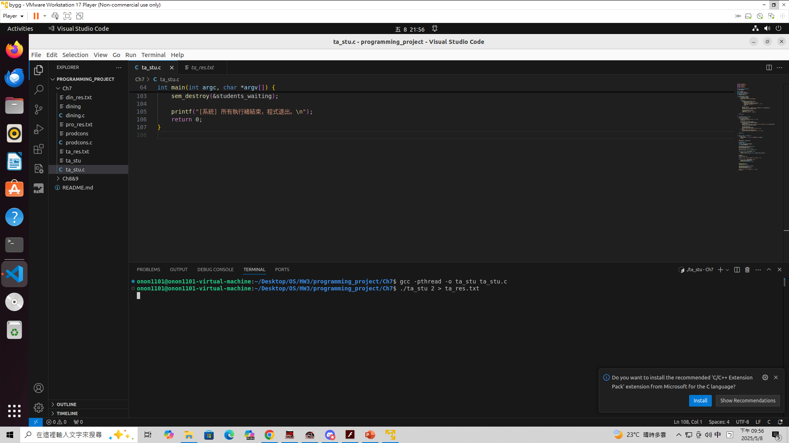
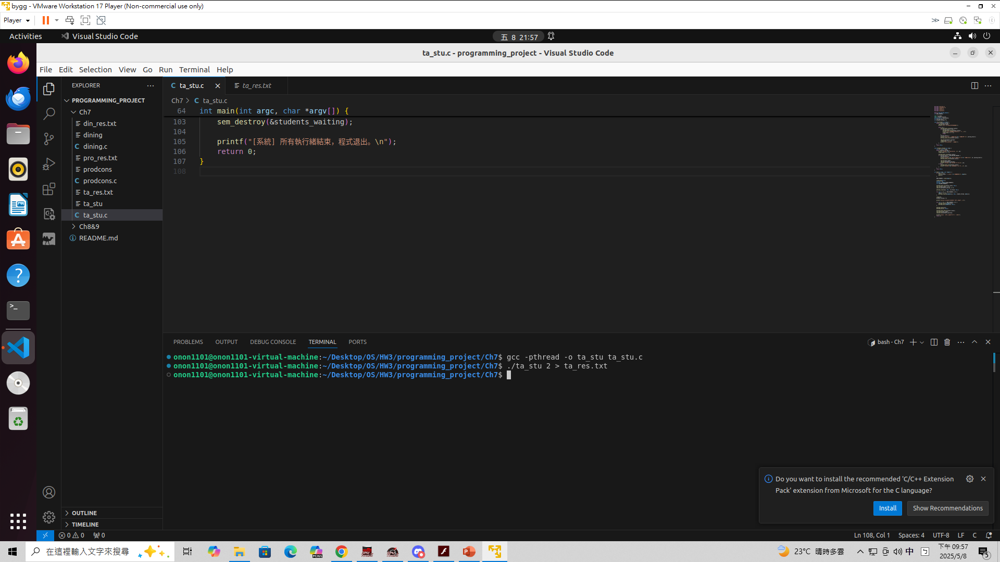

# Programming Project

## Unit 7

> [!NOTE]  
> 在本次 `Unit 7` 的問題中有諸多問題  
> 我們選擇實作 `生產者消費者問題 (Producer Consumer Problem)` 、 `哲學家用餐問題 (Dining Philosophers Problem)` 以及 `打瞌睡助教問題(Sleeping TA Problem)`  
> 分別是 `prodcons.c` 、 `dining.c` 以及 `ta_stu.c`  
> 由於原始題目中並沒有特別指明使用次數，因此都是無限次循環  
> 但在 `生產者消費者問題 (Producer Consumer Problem)` 中我們有特別做處理，避免結束之後 `Thread` 卡死在 `sem_wait` 無法結束  
> `打瞌睡助教問題(Sleeping TA Problem)` 中，我們會讓他執行 `30` 秒後結束  


### How to Compile

```
gcc -pthread -o dining dining.c
gcc -pthread -o prodcons prodcons.c
gcc -pthread -o ta_stu ta_stu.c
```


### How to use

```
./dining
./prodcons
./ta_stu <number_of_student>  
```

### Picture

> 以下會附上程式執行畫面截圖，包含：  
>
> - 生產者消費者結果    
> - 哲學家用餐過程模擬    
> - 打瞌睡助教模擬  

### 生產者消費者問題


> [!IMPORTANT]  
> 結果保留在 `pro_res.txt` 內，因為輸出內容太多所以截圖把他導出到這裡  
> Producer 1 produced: 42	Producer ，代表執行緒 #1 產生了數字 42 並成功放入 buffer  
> Consumer 2 consumed: 42	Consumer ，代表執行緒 #2 成功從 buffer 中取出並處理了數字 42  
### 哲學家用餐問題


> [!IMPORTANT]  
> 結果保留在 `din_res.txt` 內，因為輸出內容太多所以截圖把他導出到這裡  
> Philosopher 0: EATING   🍽️ ，代表哲學家在吃飯  
> Philosopher 1: THINKING 🤔 ，代表哲學家在思考  
> Philosopher 2: HUNGRY   🙏 ，代表哲學家在飢餓(有可能筷子被占用沒辦法吃飯，所以很餓)    

### 打瞌睡助教問題



> [!IMPORTANT]  
> 結果保留在 `ta_stu_res.txt` 內，因為輸出內容太多所以截圖把他導出到這裡  
> 以下是可能的結果
```
[TA] 幫助一位學生，剩下 0 位學生等候中
[Student 2] 正在接受 TA 協助
[Student 2] 正在寫作業...
[Student 1] 等待 TA 幫忙，目前有 1 位學生在等
[TA] 結束幫助一位學生
[TA] 幫助一位學生，剩下 0 位學生等候中
[Student 1] 正在接受 TA 協助
[Student 1] 正在寫作業...
[TA] 結束幫助一位學生
[TA] 沒學生了，進入打瞌睡狀態...
```


> [!IMPORTANT]  
> 結果保留在 `ta_stu_res.txt` 內，因為輸出內容太多所以截圖把他導出到這裡  
> Philosopher 0: EATING   🍽️ ，代表哲學家在吃飯  
> Philosopher 1: THINKING 🤔 ，代表哲學家在思考  
> Philosopher 2: HUNGRY   🙏 ，代表哲學家在飢餓(有可能筷子被占用沒辦法吃飯，所以很餓)   

## Unit 8&9

> [!NOTE]  

### How to Compile

### How to use

### Picture

# 組員名單及貢獻度

- 111590004 張意昌，進行 `Ch7 Producer Consumer Problem` 程式撰寫。[25%]
- 111590011 吳耀東，進行 `Ch4 Sudoku solution validator` 撰寫程式和使用文件。[25%]
- 111590012 林品緯，進行 `Ch4 Multithreaded sorting application` 撰寫程式和使用文件。[25%]
- 111590028 張睿恩，進行 `Ch7 Dining Philosophers Problem` 程式撰寫。[25%]
- 每人貢獻皆為 `25%` ，總共為 `100%` 。
