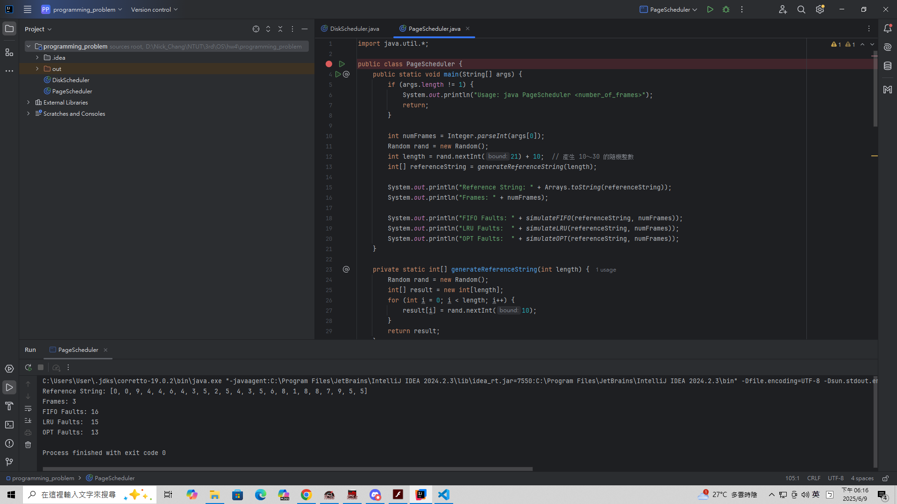
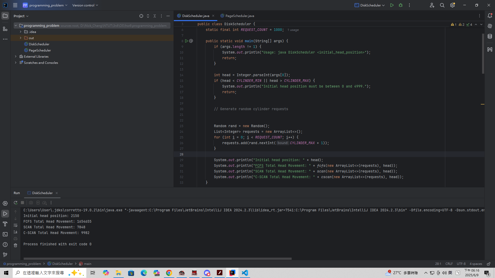

# OS Hw3 111590004 張意昌

> [!NOTE]   
> 在本次作業中有許多程式作業與手寫作業。  
> `111590004_handwrite.pdf` 是本人的手寫作業。  
> `programming_problem` 是本人的程式作業。   


## Handwrite.pdf

> 本人撰寫之手寫作業，內容參考至老師上課簡報、指定教科書及部分網路內容。  

## Programming_problem

> [!IMPORTANT]  
> 實作所有 `HW4` 之程式作業。  
> 結果檢附下方及檔案內。  

### problem 10.44

> [!IMPORTANT]  
> 本次作業中，實作一個 `Page` 的管理器，實作需求如下：  
> 1. 隨機生成數字 `0` ~ `9`  
> 2. 使用者須自行輸入 `Page Frame` 數  
> 3. 隨機生成 `Page` 字串   
> 4. 實作 `FCFS` 、 `LRU` 、 `OPT` 等三個演算法  

> [!NOTE]  
> 由於不限語言，所以選擇 `Java` 實作  
> 會隨機生成一定長度字串，並且回傳三個演算法發生錯誤的次數  
> 若使用者想更改字串，將 `13` 行改成一個陣列即可。  

```
javac PageScheduler.java
java PageScheduler <number of page frames>
```

  

- 以上為使用方法  

### problem 11.27

> [!IMPORTANT]  
> 本次作業中，實作一個 `Disk` 的管理器，實作需求如下：  
> 1. 隨機生成長度為 `1000` 的 `Block`  
> 2. 使用者須自行輸入起始位置  
> 3. 磁碟最多有 `5000` 個圓柱，也就是 `0` ~ `4999`  
> 4. 實作 `FCFS` 、 `SCAN` 、 `C-SCAN` 等三個演算法  

> [!NOTE]  
> 由於不限語言，所以選擇 `Java` 實作  
> 會隨機生成一定長度字串，並且回傳三個演算法發生錯誤的次數  
> 若使用者想更改字串，將 `24` 行改成一個 `Linked List` 即可。  

```
javac DiskScheduler.java
java DiskScheduler <Start Position>
```



## Programming_project

> 本次作業並沒有任何的團體 `project` 。  
